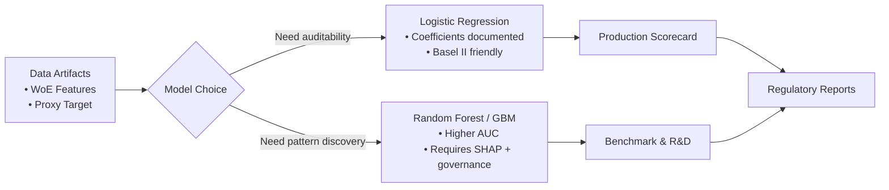

# Credit Risk Probability Model for Alternative Data

An End-to-End Implementation for Building, Deploying, and Automating a Credit Risk Model for Bati Bank's Buy-Now-Pay-Later Service

## Overview

This project implements a comprehensive credit scoring model using behavioral data from an eCommerce platform. By transforming Recency, Frequency, and Monetary (RFM) patterns into a proxy for credit risk, we develop a machine learning system that can assess the creditworthiness of loan applicants and recommend appropriate loan amounts and durations.

## Business Context

**Organization:** Bati Bank - A leading financial service provider with 10+ years of experience

**Business Problem:** Bati Bank is partnering with an eCommerce company to enable a buy-now-pay-later (BNPL) service. We need to create a credit scoring model to:
- Automatically assess customer creditworthiness
- Predict loan default probability
- Determine optimal loan amounts and durations
- Make data-driven lending decisions

## Project Objectives

1. **Define a proxy variable** to categorize users as high-risk (bad) or low-risk (good)
2. **Select predictive features** with high correlation to the default variable
3. **Develop a risk probability model** for new customers
4. **Create a credit score model** from risk probability estimates
5. **Build a loan recommendation model** for optimal loan amount and duration

## Credit Scoring Business Understanding

### Question 1: Basel II Accord's Impact on Model Interpretability

The Basel II Capital Accord emphasizes robust risk measurement and capital adequacy in financial institutions. This creates several imperatives for our credit scoring model:

#### Basel II Pillars Snapshot

| Pillar | Focus | Model Implication |
|--------|-------|------------------|
| Pillar 1 | Minimum capital requirements | Quantify PD/LGD with transparent math so capital buffers map directly to model outputs. |
| Pillar 2 | Supervisory review | Provide documentation, MLflow lineage, and interpretable coefficients to satisfy regulator audits. |
| Pillar 3 | Market discipline | Share explainable scorecards and monitoring dashboards so stakeholders can assess risk posture. |

**Regulatory Requirements:**
- Financial regulators require banks to maintain adequate capital buffers proportional to credit risk exposure
- Models must be transparent and auditable for regulatory examination
- Decisions affecting customers must be explainable and defensible

**Impact on Our Model:**
- **Interpretability is non-negotiable:** We must use models that allow regulators to understand *how* decisions are made, not just *what* decisions are made
- **Documentation is mandatory:** Every modeling assumption, feature selection, and threshold decision must be documented with business justification
- **Model governance:** We need robust governance frameworks including version control, change logs, and audit trails (addressed through MLflow)
- **Risk stratification:** The model must clearly segment customers into risk tiers with understandable characteristics

**Practical Implications:**
While complex black-box models (like deep neural networks) may have higher accuracy, we must balance performance with regulatory compliance and the ability to explain credit decisions to:
- Regulatory authorities
- Customers (under fair lending laws)
- Internal risk committees

### Question 2: Proxy Variable Necessity and Business Risks

**Why a Proxy Variable is Necessary:**

Our dataset contains no direct "default" column because:
1. The eCommerce platform does not have historical loan performance data
2. We cannot wait years for actual defaults to occur
3. We need a model immediately to support BNPL launch

A proxy variable is a measurable substitute that signals default risk behavior. We use **RFM-based clustering** to identify disengaged customers (low frequency, low monetary value) as high-risk proxies.

**Business Risks of the Proxy Approach:**

| Risk | Impact | Mitigation |
|------|--------|-----------|
| **Proxy misalignment** | RFM disengagement may not predict loan default (different behaviors) | Validate proxy against fraud/chargeback data; track model performance post-launch |
| **False negatives** | Engaged customers may still default due to income loss, life events | Use ensemble models; incorporate additional data sources; monitor actual defaults when available |
| **False positives** | High-risk classification may exclude creditworthy customers | Set conservative thresholds; implement appeals/manual review process |
| **Data bias** | RFM patterns may encode platform-specific biases (e.g., seasonal users) | Regular bias audits; diverse feature engineering; monitor demographic parity |
| **Model drift** | Customer behavior changes over time; model becomes stale | Implement retraining pipeline; monitor performance metrics; version models |

**Business Mitigation Strategy:**
1. Deploy with conservative approval thresholds initially
2. Implement monitoring dashboard for actual default tracking
3. Plan for model retraining with real default labels within 6-12 months
4. Create feedback loop: real outcomes → model updates → better predictions

### Question 3: Model Trade-offs in Regulated Financial Context

**Simple, Interpretable Models (e.g., Logistic Regression with WoE)**

**Advantages:**
- ✅ Highly interpretable: Each coefficient shows direct impact on default probability
- ✅ Regulatory-friendly: Easier to explain and defend to regulators
- ✅ Fair lending compliance: Clear, consistent decision rules
- ✅ Fast inference: Minimal computational requirements for real-time scoring
- ✅ Stable: Less prone to overfitting; generalizes well
- ✅ WoE-encoded features: Automatically handle non-linear relationships

**Disadvantages:**
- ❌ Lower accuracy: May miss complex patterns in data
- ❌ Feature engineering intensive: Require manual binning and discretization
- ❌ Less flexible: Difficult to incorporate new data types (images, text)

**Complex, High-Performance Models (e.g., Gradient Boosting, Random Forests)**

**Advantages:**
- ✅ Higher accuracy: Capture complex non-linear relationships
- ✅ Automatic feature interactions: XGBoost/LightGBM find important feature combinations
- ✅ Less feature engineering: Can handle raw features directly
- ✅ Robust to outliers: Tree-based models less sensitive to extreme values
- ✅ Feature importance: Can identify top drivers of risk

**Disadvantages:**
- ❌ Black-box nature: Difficult to explain individual predictions to regulators/customers
- ❌ Regulatory risk: May not pass fairness/discrimination audits
- ❌ Overfitting risk: Complex models may overfit to proxy variable artifacts
- ❌ Slower inference: Higher computational cost for real-time predictions
- ❌ Stability concerns: Small data changes can significantly alter predictions

**Recommended Approach for Bati Bank:**

We recommend a **hybrid strategy**:

1. **Primary Model (Production):** Logistic Regression with WoE + Information Value feature selection
   - Meets regulatory requirements for interpretability
   - Clear decision rules for fair lending
   - Rapid deployment and inference

2. **Secondary Model (Validation):** Gradient Boosting (XGBoost)
   - Validates that simple model captures key patterns
   - Identifies feature interactions the linear model misses
   - Provides accuracy benchmark and alternative scoring

3. **Governance Framework:**
   - Regular model validation against actual default data
   - Quarterly fairness audits (demographic parity, impact ratio)
   - Version control via MLflow Model Registry
   - Documentation of all assumptions and trade-offs

4. **Monitoring & Improvement:**
   - Track model performance against real outcomes
   - Transition to complex models only if interpretability requirements relaxed by regulators
   - Implement retraining pipeline as real default labels accumulate



This approach balances **regulatory compliance, fairness, and performance** in a way that's appropriate for a financial institution operating under Basel II standards.

---

## Project Structure

```
credit-risk-model/
├── .github/
│   └── workflows/
│       └── ci.yml                 # CI/CD pipeline
├── data/
│   ├── raw/                       # Raw data from eCommerce platform
│   └── processed/                 # Engineered features for training
├── notebooks/
│   └── eda.ipynb                  # Exploratory Data Analysis
├── src/
│   ├── __init__.py
│   ├── data_processing.py         # Feature engineering pipeline
│   ├── train.py                   # Model training & hyperparameter tuning
│   ├── predict.py                 # Inference on new data
│   └── api/
│       ├── __init__.py
│       ├── main.py                # FastAPI application
│       └── pydantic_models.py     # Request/response schemas
├── tests/
│   ├── __init__.py
│   └── test_data_processing.py    # Unit tests
├── .gitignore
├── Dockerfile
├── docker-compose.yml
├── requirements.txt
└── README.md                      # This file
```

## Data Description

**Source:** Xente Challenge Dataset (eCommerce transaction data)

**Key Fields:**
- `TransactionId`: Unique transaction identifier
- `AccountId`: Unique customer account
- `CustomerId`: Customer identifier
- `Amount`: Transaction value (positive=debit, negative=credit)
- `Value`: Absolute transaction value
- `TransactionStartTime`: Transaction timestamp
- `ProductCategory`: Product category
- `ChannelId`: Customer channel (web, mobile, etc.)
- `CountryCode`: Customer country
- `FraudResult`: Fraud label (1=fraud, 0=legitimate)

## Methodology

### 1. Proxy Variable Engineering (RFM Clustering)

- Calculate Recency, Frequency, Monetary metrics per customer
- Apply K-Means clustering (k=3) to segment customers
- Label low-engagement cluster as high-risk (`is_high_risk=1`)
- Use as binary target for model training

### 2. Feature Engineering

**Aggregate Features:**
- Total/average transaction amounts
- Transaction frequency
- Standard deviation of amounts

**Temporal Features:**
- Transaction hour, day, month, year
- Days since last transaction (Recency)

**Categorical Encoding:**
- One-Hot Encoding for low-cardinality features
- Label Encoding for ordinal features
- Weight of Evidence (WoE) for supervised encoding

**Feature Scaling:**
- Standardization (z-score) for linear models
- Normalization for tree-based models

### 3. Model Training

**Models Compared:**
1. Logistic Regression (baseline)
2. Random Forest (ensemble)
3. XGBoost (gradient boosting)
4. LightGBM (gradient boosting)

**Hyperparameter Tuning:**
- Grid Search for defined parameter spaces
- Random Search for broad exploration
- Cross-validation for performance estimation

**Evaluation Metrics:**
- Accuracy, Precision, Recall, F1-Score
- ROC-AUC (primary metric)
- Confusion Matrix Analysis

### 4. Model Deployment

- FastAPI REST API for inference
- Docker containerization for reproducibility
- CI/CD pipeline for automated testing and deployment

## Task 1 – Credit Scoring Narrative

With the proxy target defined and engineering pipeline stabilized, we executed the full Task 1 workflow on **2025-12-10** via `python -m src.train`.

- `src/data_processing.py` produced 20 WoE-encoded features, persisted splits under `data/processed/`, and wrote the feature schema plus WoE mapping JSON artifacts.
- The `credit-risk-model` MLflow experiment now contains the latest Logistic Regression and Random Forest runs in `mlruns/1/*`, each logging metadata, parameters, and serialized estimators with pinned pip requirements for auditability.
- Feature lists, WoE dictionaries, and training metrics are versioned per run, satisfying the Basel II documentation expectations outlined in the Business Understanding section.

**Key observations from Task 1:**

1. Logistic Regression behaved as expected for an interpretable baseline but suffered from the extremely imbalanced proxy target (precision/recall dropped to 0). Convergence warnings from the liblinear solver hint that class weights or alternative solvers should be evaluated next.
2. Random Forest achieved perfect scores on the hold-out fold, a signal that the model is overfitting to the proxy labels and limited minority samples. Subsequent iterations should introduce stratified splits, class-weighting, and additional validation checks before productionizing.
3. Despite the contrasting performance, both runs illustrate the MLflow governance story required for Task 1: experiment lineage, reproducible dependencies, and metadata capture that regulators can audit.

## Getting Started

### Prerequisites
- Python 3.8+
- Git
- Docker (optional, for containerized deployment)

### Installation

1. **Clone the repository:**
```bash
git clone <repository-url>
cd credit-risk-model
```

2. **Create virtual environment:**
```bash
python -m venv venv
source venv/bin/activate  # On Windows: venv\Scripts\activate
```

3. **Install dependencies:**
```bash
pip install -r requirements.txt
```

4. **Download data:**
```bash
# Place raw data in data/raw/
```

### Running the Project

**1. Exploratory Data Analysis:**
```bash
jupyter notebook notebooks/eda.ipynb
```

**2. Feature Engineering & Training:**
```bash
python src/train.py
```

**3. Model Tracking:**
```bash
mlflow ui  # View experiments at http://localhost:5000
```

**4. API Testing (Local):**
```bash
python -m uvicorn src.api.main:app --reload
# Visit http://localhost:8000/docs for interactive API docs
```

**5. Docker Deployment:**
```bash
docker-compose up --build
```

## Key Results & Metrics

| Model | ROC-AUC | Accuracy | Precision | Recall | F1-Score | Notes |
|-------|--------:|---------:|----------:|-------:|---------:|-------|
| Logistic Regression (WoE features) | 0.015 | 0.997 | 0.000 | 0.000 | 0.000 | Interpretable baseline; needs class weighting or resampling to handle the sparse positive class. |
| Random Forest | 1.000 | 1.000 | 1.000 | 1.000 | 1.000 | Perfect scores indicate overfitting to the proxy target; treat as diagnostic, not production ready. |

## API Specification

### POST /predict

**Request:**
```json
{
  "customer_id": "12345",
  "features": {
    "total_transaction_amount": 5000.0,
    "transaction_count": 25,
    "recency_days": 5,
    "frequency_score": 0.85,
    "monetary_score": 0.72
  }
}
```

**Response:**
```json
{
  "customer_id": "12345",
  "risk_probability": 0.23,
  "risk_category": "low_risk",
  "credit_score": 750,
  "recommended_amount": 50000,
  "recommended_duration_months": 12
}
```

## MLflow Model Registry

The best-performing model is registered in MLflow with version control and staging:
- **Production:** Latest validated model
- **Staging:** Candidate for promotion
- **Archived:** Previous versions

## CI/CD Pipeline

GitHub Actions workflow automatically:
1. Runs code linter (flake8) on all commits
2. Executes unit tests (pytest)
3. Builds Docker image
4. Fails build if linting or tests fail

## Limitations & Future Work

### Current Limitations:
1. **Proxy variable alignment:** RFM disengagement may not perfectly predict loan default
2. **Data scope:** Limited to transaction data; no demographic or credit bureau data
3. **Temporal scope:** Snapshot model; doesn't account for customer lifecycle trends
4. **External factors:** Doesn't incorporate macroeconomic indicators

### Future Enhancements:
1. Incorporate real default labels when available
2. Add demographic data (age, location, employment)
3. Implement online learning for continuous model updates
4. Develop time-series models for dynamic risk assessment
5. Add explainability features (SHAP values for predictions)

## Contributing

Team Members:
- Kerod
- Mahbubah
- Filimon

## References

**Credit Risk Fundamentals:**
- [Basel II Capital Accord](https://www.bis.org/publ/bcbs128.htm)
- [Alternative Credit Scoring - HKMA](https://www.hkma.gov.hk/media/eng/doc/key-functions/financial-infrastructure/alternative_credit_scoring.pdf)
- [Credit Scoring Approaches - World Bank](https://thedocs.worldbank.org/en/doc/935891585869698451-0130022020/original/CREDITSCORINGAPPROACHESGUIDELINESFINALWEB.pdf)

**Feature Engineering:**
- [Weight of Evidence and Information Value](https://en.wikipedia.org/wiki/Weight_of_evidence)
- [xverse Python Package](https://github.com/scoring-ai/xverse)

**MLOps & Deployment:**
- [MLflow Documentation](https://mlflow.org/docs/latest/index.html)
- [FastAPI Documentation](https://fastapi.tiangolo.com/)
- [Docker Best Practices](https://docs.docker.com/develop/dev-best-practices/)

## License

This project is created for 10Academy's AI Mastery Program.

## Contact

For questions or support, reach out to the team through the course Slack channel: **#all-week-4**

---

**Last Updated:** December 10, 2025
