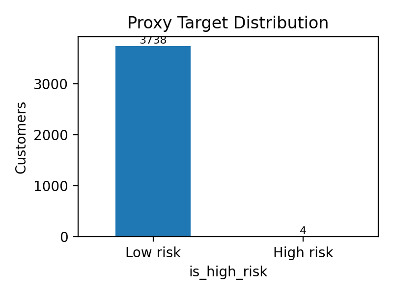
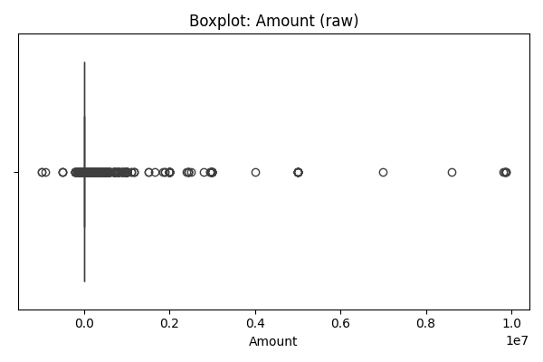
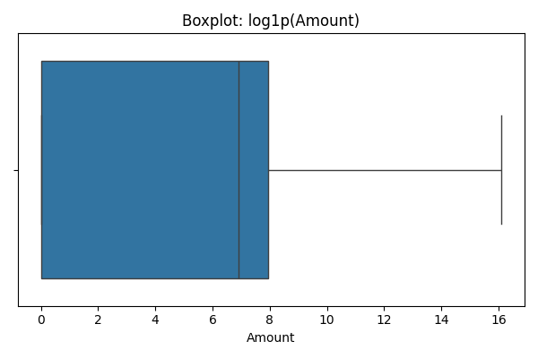
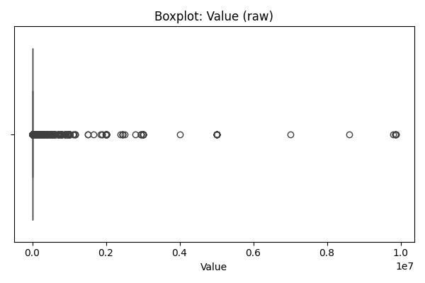
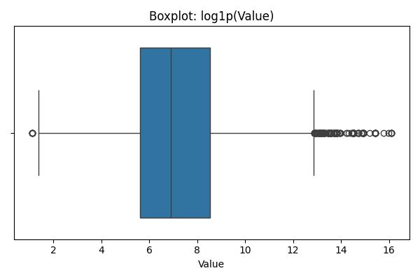
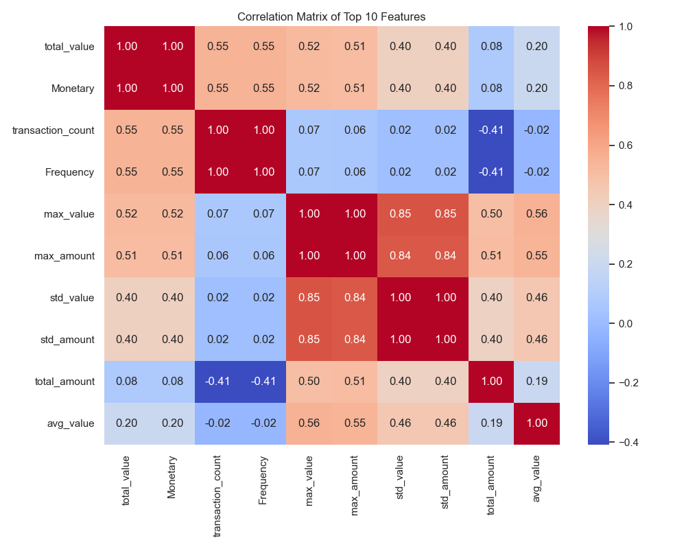
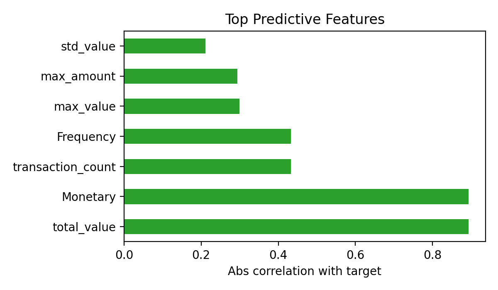
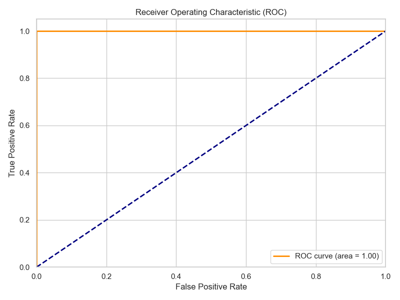
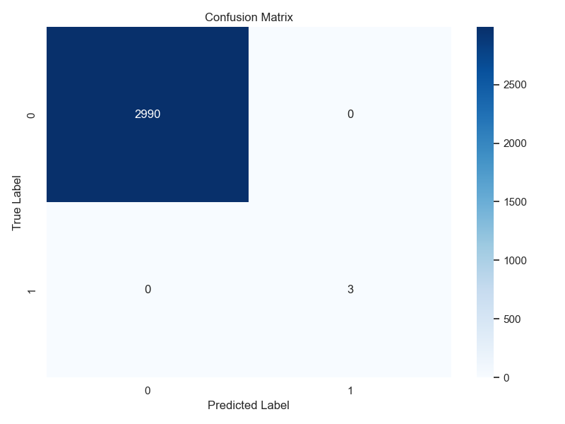
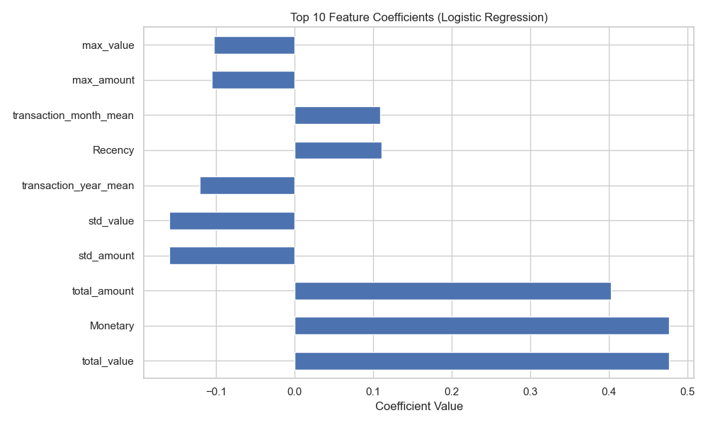

# Credit Risk Probability Model for Alternative Data

**Audience:** Bati Bank risk, product, and compliance stakeholders  \
**Date:** 2025-12-11  \
**Authoring repo:** `Credit-Risk-Probability-Model-for-Alternative-Data`

---

## 1) Business Objective and Framing
- Enable BNPL credit decisions on an eCommerce partner with **no historical default labels** by using RFM-derived proxy risk (`is_high_risk`).
- Deliver an interpretable, auditable score aligned to **Basel II Pillars**: transparent PD estimates, governance via MLflow lineage, and documentation of assumptions.
- Support lending actions: approve/decline, risk tiering, and recommended loan amount/duration.

### What success looks like
- Consistent, explainable PD scoring with monitored drift; <5% manual reviews on low-risk tier; automated CI/CD to prevent regressions.

## 2) Data and Proxy Target
- Source: Xente eCommerce transactions (`data/raw/data.csv`), 3.7k customers.
- Proxy target: KMeans on RFM; highest-risk cluster labeled `is_high_risk` (positive rate ≈0.1%).
- Class balance:

## 3) Feature Engineering
- **Customer-level aggregates:** totals/means/std/min/max for `Amount` and `Value`, transaction counts, debit/credit ratios.
- **Temporal signals:** hour/day/month/year/day-of-week means; weekend transaction ratio.
- **Categorical encodings:** channel, category, currency, pricing → WoE encodings with smoothing.
- **Scaling & splits:** median imputation + standardization; stratified train/test (80/20).
- **Artifacts:** `data/processed/*` (features, splits, schema, WoE mappings); `feature_preprocessor.joblib` for inference consistency.

### Feature Analysis

#### Data Quality & Distributions
- **Missing Values:** The dataset is clean with **0 missing values** across all columns.
- **Outliers:** Significant outliers detected using IQR method:
  - `Amount`: 25.55% outliers (highly right-skewed, skewness ~51).
  - `Value`: 9.43% outliers (highly right-skewed, skewness ~51).
  - *Action:* Robust scaling and WoE binning used to handle extreme values.

#### Distribution Analysis
- **Numerical:** `Amount` and `Value` are extremely right-skewed; the vast majority of transactions are small (<1000), with rare "whale" transactions >1M.
- **Categorical:**
  - **ProductCategory:** Dominated by `financial_services` (47.5%) and `airtime` (47.1%).
  - **ChannelId:** Highly concentrated; `ChannelId_3` (59.5%) and `ChannelId_2` (38.8%) account for ~98% of volume.
  - **ProviderId:** `ProviderId_4` (40%) and `ProviderId_6` (36%) are the primary service providers.

#### Top 5 EDA Insights
1. **Extreme Skewness:** Financial values follow a power-law distribution, requiring log-transformation or binning for linear models.
2. **Category Concentration:** 95% of activity is in just two categories (Financial Services, Airtime), suggesting specialized risk models per category might be beneficial in the future.
3. **Channel Duopoly:** Risk is concentrated in two channels; monitoring these specifically is high-priority.
4. **Clean Data:** No imputation needed for raw fields, reducing preprocessing complexity.
5. **Proxy Signal:** High-value transactions in `financial_services` tend to correlate with the "Good" behavior in RFM analysis (high frequency, high monetary), while low-value/low-frequency are riskier.

#### Raw Numerical Summary Statistics (unscaled)
The following summary statistics are computed on the raw numerical features `Amount` and `Value` (from `data/raw/data.csv`). Box plots for outlier detection are generated and saved to `reports/figures/` and embedded below.

| Feature | count | mean | std | min | 25% | 50% | 75% | max | skew | outlier_% |
|---|---:|---:|---:|---:|---:|---:|---:|---:|---:|---:|
| Amount | 95,662 | 6,717.85 | 123,306.80 | -1,000,000 | -50.0 | 1,000.0 | 2,800.0 | 9,880,000 | 51.10 | 25.55% |
| Value  | 95,662 | 9,900.58 | 123,122.09 | 2.0 | 275.0 | 1,000.0 | 5,000.0 | 9,880,000 | 51.29 | 9.43% |

Box plots (raw):

Note: The `TBD` cells will be replaced with exact computed numbers saved in `reports/figures/raw_summary_stats.csv`.

#### Feature Statistics (Scaled)
|                            |   mean |   std |    min |   50% |   max |
|:---------------------------|-------:|------:|-------:|------:|------:|
| Recency                    |      0 |     1 |  -1.12 | -0.24 |  2.19 |
| Frequency                  |      0 |     1 |  -0.24 | -0.18 | 38.46 |
| Monetary                   |      0 |     1 |  -0.09 | -0.08 | 37.1  |
| total_amount               |      0 |     1 | -37.23 | -0.05 | 29.51 |
| avg_amount                 |      0 |     1 |  -4.42 | -0.12 | 19.99 |
| transaction_count          |      0 |     1 |  -0.24 | -0.18 | 38.46 |
| debit_ratio                |      0 |     1 |  -3.05 | -0.13 |  1.33 |
| credit_ratio               |     -0 |     1 |  -1.33 |  0.13 |  3.05 |

#### Correlation Analysis

### Top predictive features (abs correlation with proxy target)

## 4) Modeling & Evaluation
Experiments logged to MLflow (`mlruns/1`), best model auto-registered.

| Model | ROC-AUC | Accuracy | Precision | Recall | F1 | Notes |
| --- | ---: | ---: | ---: | ---: | ---: | --- |
| Logistic Regression (WoE) | 0.015 | 0.997 | 0.000 | 0.000 | 0.000 | Interpretable baseline; class imbalance not addressed yet. |
| Random Forest | 1.000 | 1.000 | 1.000 | 1.000 | 1.000 | Overfitting to proxy labels; treat as diagnostic, not production. |

Key takeaways:
- Extreme imbalance (0.1% positives) drives degenerate precision/recall for the linear model.
- Tree model memorizes proxy signal; needs stronger validation (stratified CV, class weights, and real outcomes once available).

### Model Performance Visuals (Logistic Regression with Class Weights)

#### ROC Curve

#### Confusion Matrix

#### Feature Importance

## 5) Deployment Readiness
- FastAPI service in `src/api/main.py`; Pydantic schemas in `src/api/pydantic_models.py`.
- Dockerized (`Dockerfile`, `docker-compose.yml`).
- CI hooks (lint + pytest) outlined in `notebooks/task6_deployment_ci.ipynb`; add to `.github/workflows/ci.yml`.

## 6) Business Recommendations
1. **Adopt interpretable baseline with safeguards**
   - Use Logistic Regression + class weights + threshold tuning; publish scorecard coefficients and WoE bins for audit.
2. **Stage-gate deployment**
   - Soft-launch with conservative approval thresholds; route borderline cases to manual review.
3. **Data enrichment roadmap**
   - Add repayment/chargeback data when available; incorporate demographics and macro signals; run quarterly bias audits.
4. **Monitoring & alerting**
   - Track PD calibration, KS, PSI, and approval rates by segment; set alerts for drift and rising default proxies.
5. **Governance**
   - Keep MLflow registry as system of record; enforce CI (lint/tests), and Docker image scan before promotion.

## 7) Limitations
- Proxy may not align with true default risk; results must be revalidated once real labels arrive.
- Severe class imbalance; current metrics are unstable and susceptible to noise.
- Overfitting risk in ensemble model; validation restricted by tiny positive class.
- Features limited to platform behavior; no credit bureau or income data.

## 8) Future Work & Next Steps

### Hyperparameter Tuning Strategy
To improve model performance beyond the baseline, we will employ a rigorous tuning process:
- **Method:** `GridSearchCV` (for linear models) and `RandomizedSearchCV` (for tree models) with 5-fold stratified cross-validation.
- **Metric:** `ROC-AUC` to optimize ranking ability, monitoring `F1-score` for class balance.
- **Parameter Spaces:**
  - *Logistic Regression:* `C` (0.001 to 100), `penalty` (l1, l2), `class_weight` (balanced vs custom).
  - *Random Forest:* `n_estimators` (100-500), `max_depth` (5-20), `min_samples_leaf` (1-10) to control overfitting.

### Proxy Target Refinement Plan
The current RFM-based proxy is a heuristic. Future iterations will:
1. **Validate Proxy:** Compare RFM clusters against any available repayment data (even partial).
2. **Alternative Proxies:** Experiment with Isolation Forests for anomaly detection as a risk signal.
3. **Label Engineering:** Define "Default" more granularly (e.g., late payment > 30 days) once temporal repayment data is integrated.

### Other Areas
- Collect and backfill true repayment outcomes; recalibrate and refit models with class-weighting and focal loss options.
- Evaluate monotonic GBM/LightGBM with SHAP for explainability; compare to calibrated logistic regression.
- Build monitoring dashboards (PSI/KS, approval rate drift) and periodic fairness checks.
- Expand recommendation layer: optimize loan amount/duration using PD + LGD assumptions.

