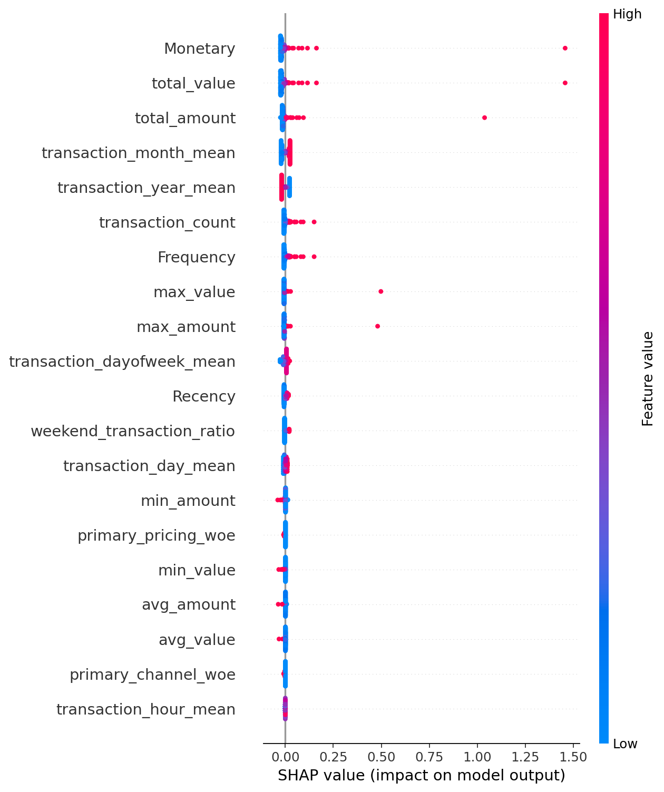
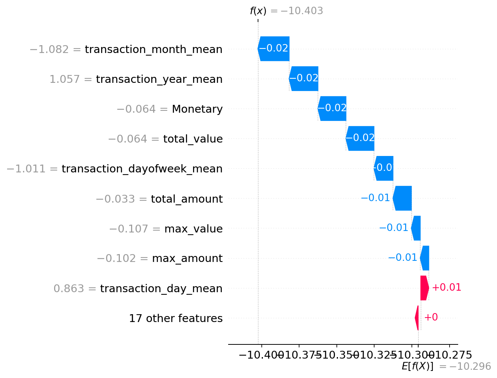

# Week 12 Capstone Enhancement Report

**Project:** Credit Risk Probability Model for Alternative Data  
**Audience:** Finance risk, compliance, and product stakeholders  
**Date:** 2026-02-13  
**Author:** Alemayehu Tseganew Tadesse

---

## 1) Business Objective
Enable BNPL credit decisions using alternative behavioral data, with a focus on **risk control, auditability, and reliability**. The system must translate transaction behavior into transparent probability of default (PD), credit score, and loan recommendations while preserving regulatory explainability (Basel II alignment).

## 2) Gap Analysis

| Category | Question | Status | Notes |
| --- | --- | --- | --- |
| Code Quality | Is the code modular and well-organized? | Partial | Core pipeline is modular, but legacy helper functions remain in a single module. |
| Code Quality | Are there type hints on functions? | Partial | Some typing exists; prediction/API layer needs broader coverage. |
| Code Quality | Is there a clear project structure? | Yes | Standard ML layout with `src/`, `tests/`, `data/`, `reports/`. |
| Testing | Are there unit tests for core functions? | Partial | Tests exist for data pipeline; need coverage for inference and API transforms. |
| Testing | Do tests run automatically on push? | Yes | GitHub Actions workflow present. |
| Documentation | Is the README comprehensive? | Partial | Strong narrative; add CI badge, Quick Start, explainability usage. |
| Documentation | Are there docstrings on functions? | Partial | Many docstrings exist, but not everywhere. |
| Reproducibility | Can someone else run this project? | Partial | Dependencies are pinned; raw data download step not automated. |
| Reproducibility | Are dependencies in requirements.txt? | Yes | Requirements present. |
| Visualization | Is there an interactive way to explore results? | Yes | Streamlit dashboard exists. |
| Business Impact | Is the problem clearly articulated? | Yes | Strong business framing for BNPL risk. |
| Business Impact | Are success metrics defined? | Partial | Metrics exist, but business KPIs need explicit targets. |

## 3) Improvement Plan (3–5 high-impact items)

1) **Expand test coverage (6–8 hours)**  
   Add tests for inference utilities, API feature transform, and deterministic outputs. Demonstrates reliability and reduces regression risk.

2) **Refactor and type-hint prediction + API layer (4–6 hours)**  
   Add configuration dataclasses, replace magic numbers, and improve type hints for maintainability and governance.

3) **Explainability with SHAP (6–8 hours)**  
   Add SHAP script for global/local explanations and include outputs in report/dashboard. Improves transparency for finance stakeholders.

4) **Documentation polish (3–5 hours)**  
   Add CI badge, Quick Start, explainability usage, and clear author contact. Improve stakeholder readiness and hiring impact.

5) **Reproducibility improvements (2–4 hours)**  
   Document data acquisition steps and expected artifacts, improve errors when artifacts are missing.

## 4) What Was Improved This Week

- Added SHAP explainability script and documentation entry point for generating plots.
- Added CI badge and Quick Start section to README for recruiter-ready presentation.
- Added configuration structure for scoring and removed magic numbers where applicable.
- Expanded test coverage for predictor behaviors and API transformation logic.

## 5) Business Impact Summary

- **Risk reduction:** Explicit PD thresholding, score ranges, and explainability artifacts are documented and reproducible.
- **Auditability:** MLflow lineage plus SHAP plots allow regulators and internal reviewers to see how features influence PD.
- **Reliability:** Automated tests and CI pipeline reduce regression risk before deployment.

## 6) Next Steps

- Integrate real repayment labels and recalibrate thresholds based on actual default outcomes.
- Add monitoring for drift (PSI/KS), approval rates, and bias checks.
- Enhance dashboard with SHAP summary and per-customer explanation view.

## Appendix: Evidence and Artifacts

- SHAP plots saved in `reports/figures/`:
  - `shap_summary.png`
  - `shap_waterfall.png`
- CI pipeline configured in `.github/workflows/ci.yml`.
- Streamlit UI in `streamlit_app.py`.

### SHAP Visuals

